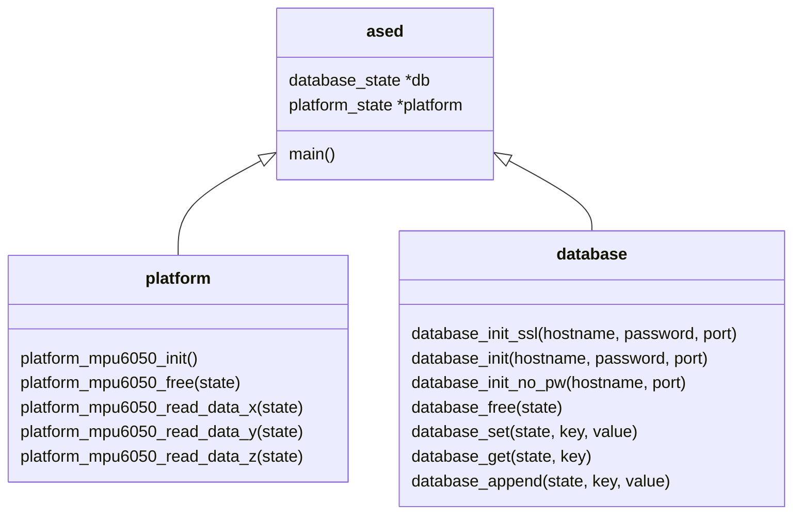

# ased

**a**cceleration-**s**ensor-**e**rror-**d**etection

- ased kompilieren:
  ```sh
  make
  ```
- testen:
  ```sh
  make test
  ```

## API


```mermaid
classDiagram
    ased <|-- platform
    ased <|-- database
    ased: database_state *db
    ased: platform_state *platform
    ased: main()
    class platform {
        platform_mpu6050_init()
        platform_mpu6050_free(state)
        platform_mpu6050_read_data_x(state)
        platform_mpu6050_read_data_y(state)
        platform_mpu6050_read_data_z(state)
    }
    class database {
        database_init_ssl(hostname, password, port)
        database_init(hostname, password, port)
        database_init_no_pw(hostname, port)
        database_free(state)
        database_set(state, key, value)
        database_get(state, key)
        database_append(state, key, value)
    }
```
